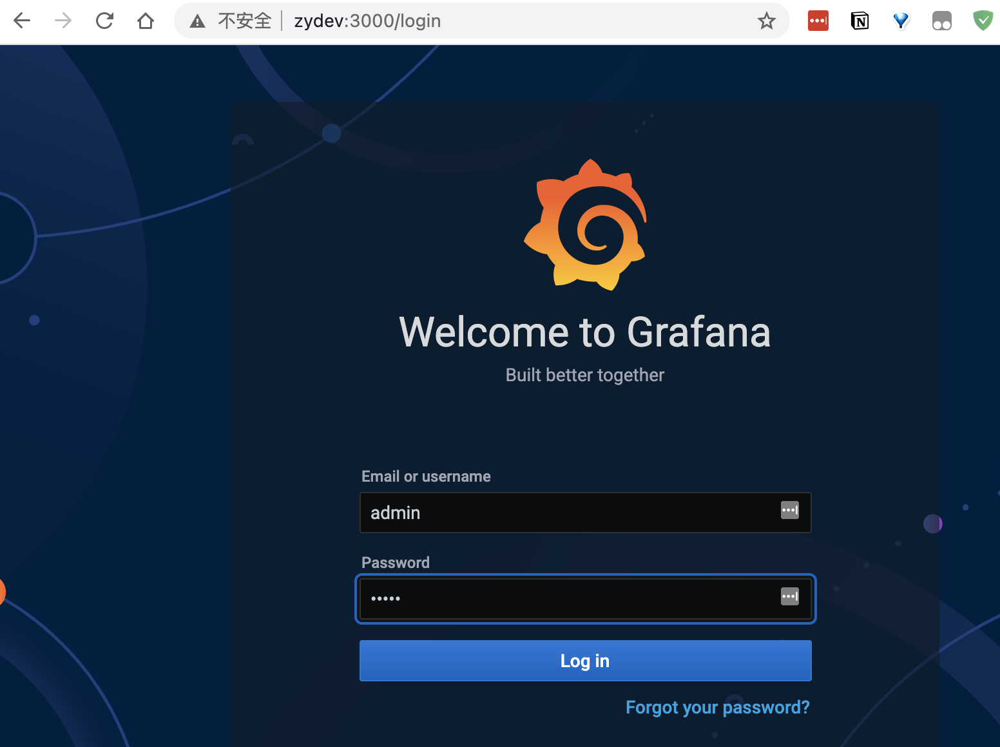
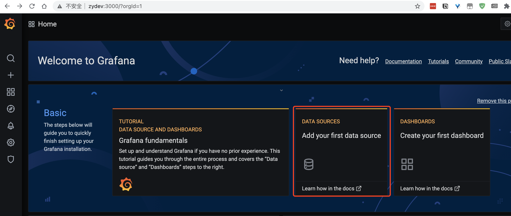
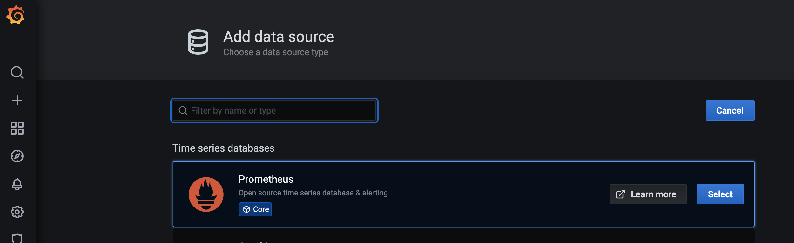
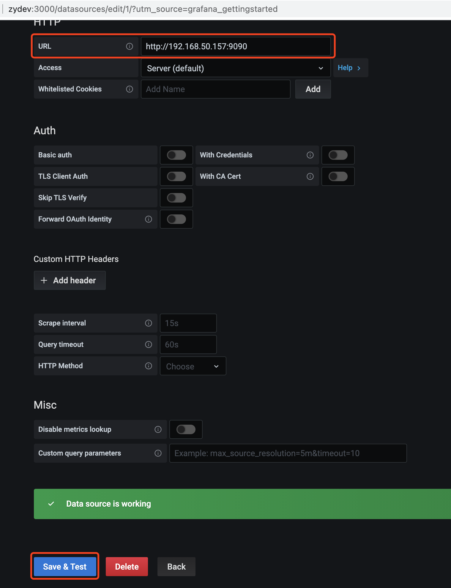
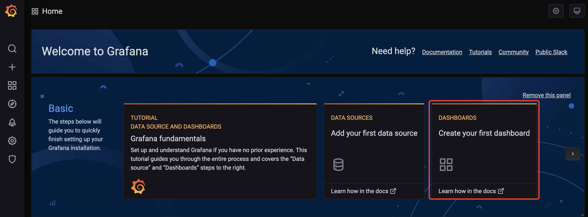
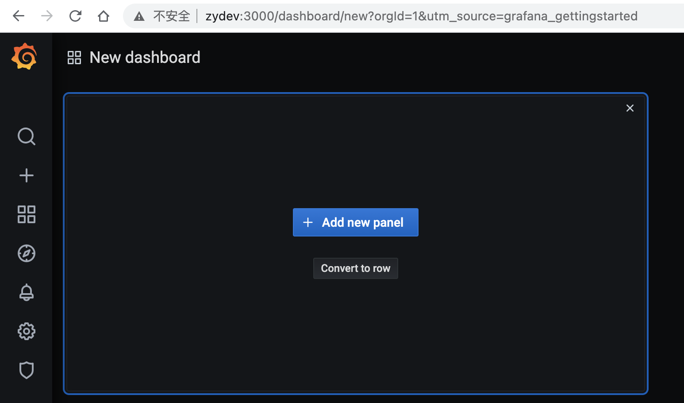
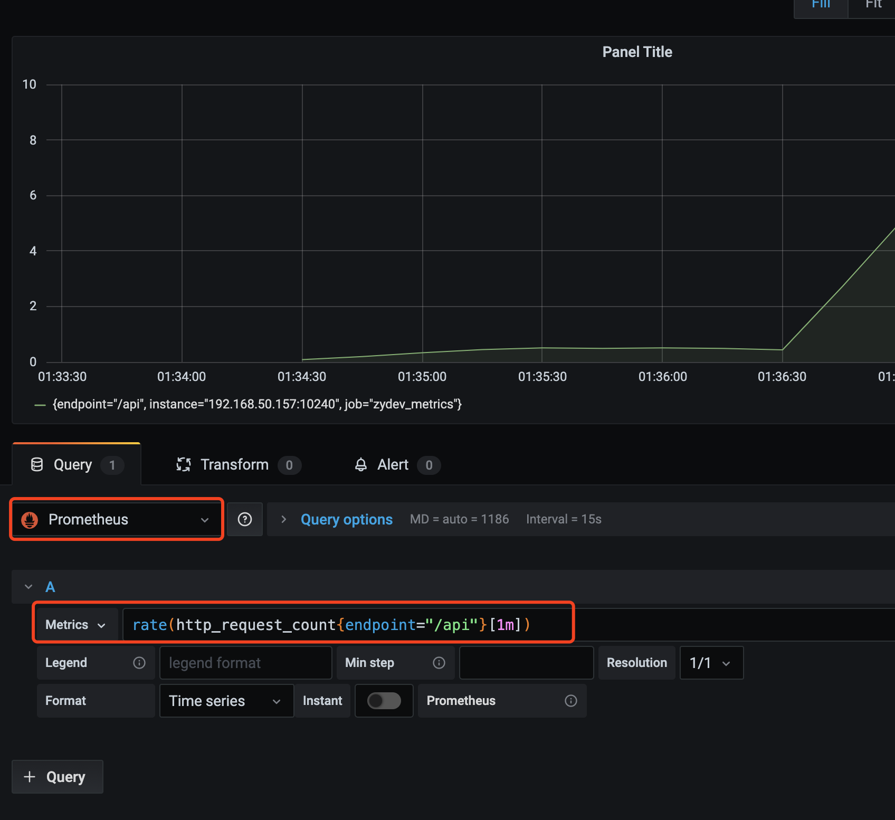
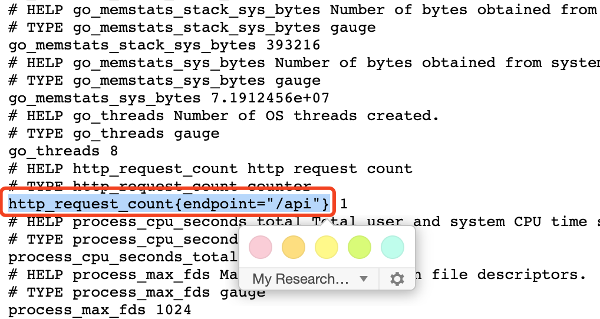

# Prometheus + Grafana Demo
一个QPS的演示。


整个demo的项目由下列几部分组成：

1. Prometheus - 用于收集数据及统计
2. Grafana - 用于UI展示
3. HTTP Server in Golang - HTTP服务


**场景描述：**

1. 我们有个Golang写的HTTP服务，提供正常的业务。
2. 希望通过接入Prometheus监控该HTTP服务的QPS数据。
3. 能将QPS的相关数据在Grafana上面进行展示。


## 启动HTTP服务

1. 需要Prometheus SDK，安装：

```bash
go get github.com/prometheus/client_golang/prometheus
```

2. 启动HTTP服务

```bash
# cd ./demo/

go run .
# 2021/01/07 13:44:55 listen on: :10240
```

查看prometheus默认的统计数据：

```
# 浏览器打开 http://{ip}:10240/metrics

# HELP go_gc_duration_seconds A summary of the pause duration of garbage collection cycles.
# TYPE go_gc_duration_seconds summary
go_gc_duration_seconds{quantile="0"} 0
go_gc_duration_seconds{quantile="0.25"} 0

# ...
```

调用`/api`接口，

```bash
curl http://localhost:10240/api
```

重新打开`/metrics`页面，搜索在代码中设置搜集数据的关键字`http_request_count`，

```
# ...
# HELP http_request_count http request count
# TYPE http_request_count counter
http_request_count{endpoint="/api"} 1
# ...
```

- `1`表示调用了一次。


## 安装Prometheus

直接使用`docker-compose`进行安装。

```bash
cd ./prometheus

docker-compose up -d
```

## 安装Grafana

使用`docker`进行安装。

```bash
docker run -d -p 3000:3000 grafana/grafana
```

默认账号密码：admin/admin


## 配置grafana

浏览器打开页面：`http://{ip}:3000`，登陆后。




### a. 添加Prometheus的数据源



选择`Prometheus`




填入`Prometheus`对应的IP地址后，点击保存。




### b. 配置数据展示界面







添加一个`Panel`，配置如下。




解释一下，

```
rate(http_request_count{endpoint="/api"}[1m])
```


- 统计参数为：`http_request_count`，代码中设定的名字。

- `http_request_count{endpoint="/api"}`可以从http服务/metrics页面中搜索获取。

    

- `rate` - 统计QPS
- `[1m]` - 过去1分钟的数据参考

### c. 加大并发请求

```bash
# 10 QPS
watch -n 0.1 "curl -s http://localhost:10240/api"
```

加大并发请求后，查看Grafana的界面变化。


## 参考资料

- [Prometheus的配置与服务发现](https://yasongxu.gitbook.io/container-monitor/yi-.-kai-yuan-fang-an/di-2-zhang-prometheus/prometheus-de-pei-zhi-yu-fu-wu-fa-xian)

