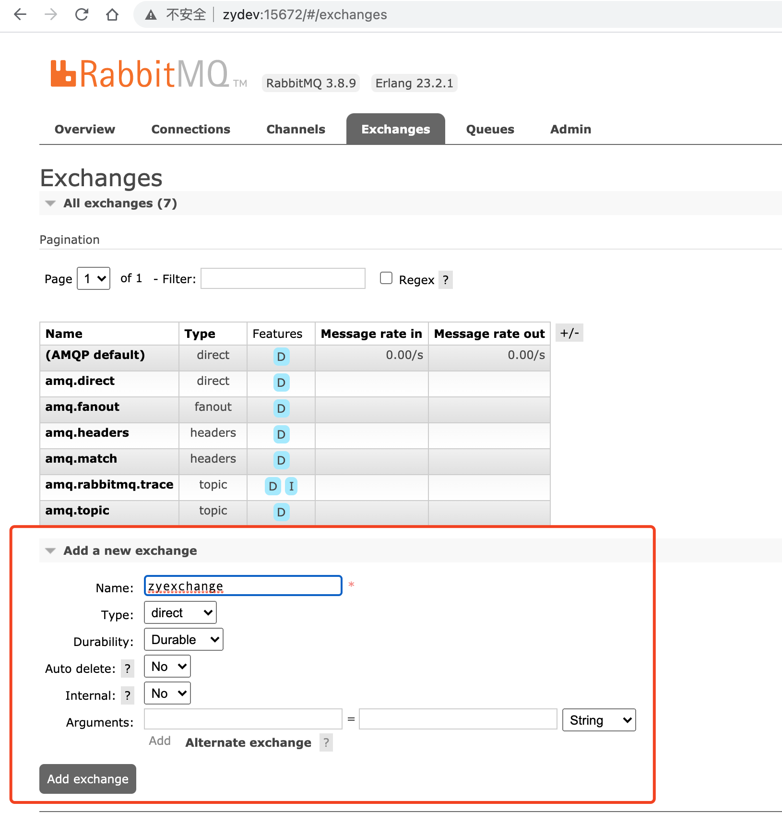

# RabbitMQ Demo

## 1. 启动RabbitMQ

使用[RabbitMQ in docker-compose](https://github.com/micahhausler/rabbitmq-compose)启动`RabbitMQ`服务。

启动如下，

```bash
git clone git@github.com:micahhausler/rabbitmq-compose.git
cd rabbitmq-compose
docker-compose up
```

说明：

- 控制台界面：浏览器打开：`http://{ip}:15672`地址
- 用户名/密码都为：`rabbitmq`


## 2. 配置RabbitMQ

打开RabbitMQ的控制台界面，




点击`Exchanges`标签，创建一个demo的Exchanges。如果代码中不指定Exchange，则使用默认的。

- Name - `zyexchange`
- Type - `direct`


## 3. Golang程序

**参考资料：**

- [RabbitMQ tutorial-one-go](https://www.rabbitmq.com/tutorials/tutorial-one-go.html)


安装依赖sdk：

```bash
go get github.com/streadway/amqp
```

### 3.1 生产消息

代码中，

- exchange - `zyexchange`
- binding - 通过`routing_key=zyqueue`找到`zyqueue`队列

```bash
cd producer/

# host指定rabbitmq的IP地址。默认使用localhost
go run . -host="zydev"
# 2021/01/05 23:07:43  [x] Sent Hello World!
```

### 3.2 消费消息

代码中会消费`zyqueue`队列中的消息，

```bash
cd consumer/

# host指定rabbitmq的IP地址。默认使用localhost
go run . -host="zydev"
```

接收到消息后，结果如下：

```
❯ go run . -host="zydev"
2021/01/05 23:57:12  [*] Waiting for messages. To exit press CTRL+C
2021/01/05 23:57:15 Received a message: Hello World!
```

